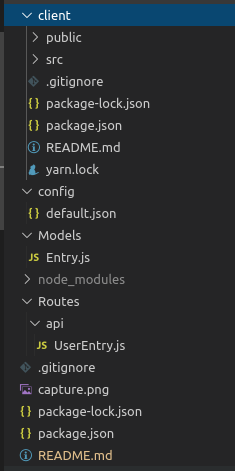

# Innovaccer Assignment

## Problem Statement

Given the visitors that we have in office and outside, there is a need to for an entry management software.

## How to start this application?

```
# change default.json file in config folder

# this file is located in config/default.json

# add uri of your mongodb connection for example

 "mongoURI": "mongodb://127.0.0.1/anydbname",

```

```bash
# Install server dependencies
npm install

# Install client dependencies
cd client
npm install

# Run both Express & React from root
npm run dev
```

## Tech Stack

1. ReactJS
2. NodeJS
3. ExpressJS
4. MongoDB

## Folder Structure:



## Images


## App Info

This is an entry management system used for tracking the entry and exit details of a person.
As the app loads up, a form is displayed in which you can enter the details and email & msg will be sent to host consisting of your details. When you have to end your meeting/session, Go to 'Current Session' tab and end your session. This will send an email to a visitor regarding his/her visit.

## How to use?

1. As the first page loads up a form is displayed (as shown in figure above).

2. Enter the details of the visitor and host. The visitor details will be sent to host via     E-mail and Message.

3. When a user has to checkout, click on the 'Current Session' tab and end the session.

4. An E-mail will be sent to user consisting information about the visit.

5. To view the ended sessions- Click on 'Ended Session' tab and you will be redirected to      the route consisting details of ended sessions.


## Author

Name: Apoorv Taneja

Email: apoorvtaneja@outlook.com and 17uec026@lnmiit.ac.in

Phone No.: +91 9834412453

Website: https://plxity.github.io/


