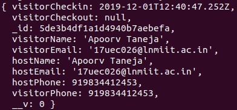
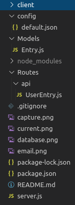
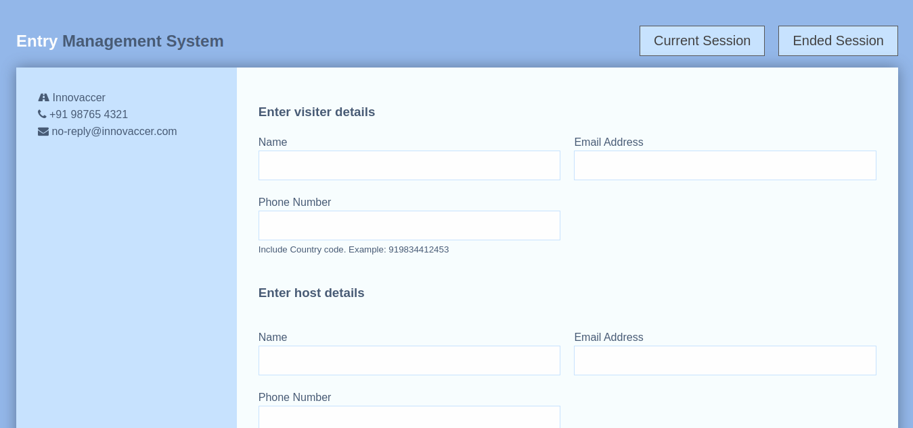
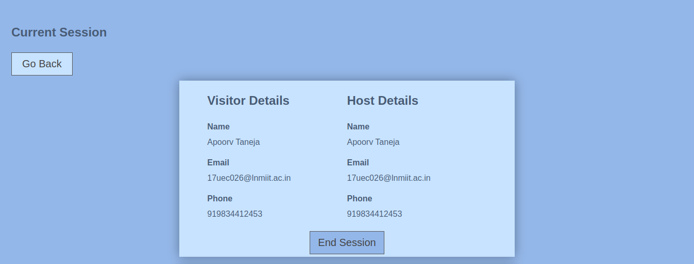
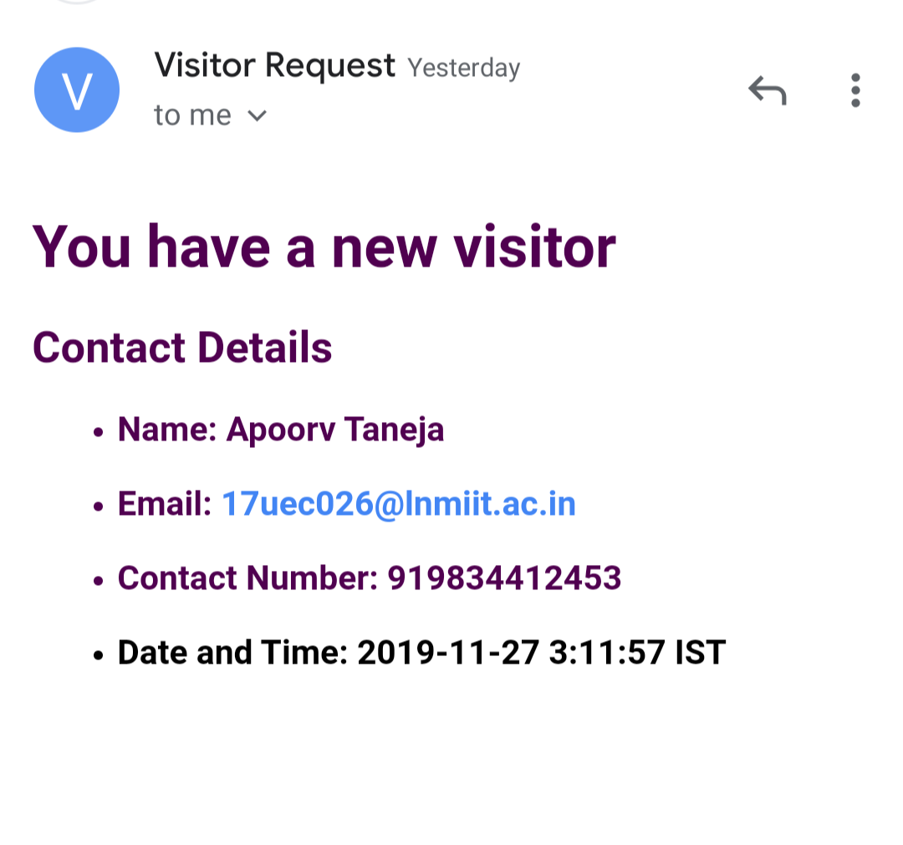
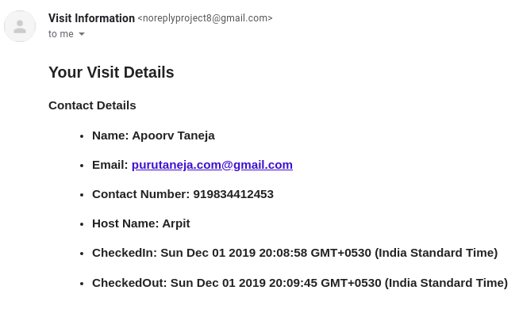

# Innovaccer Assignment

## Problem Statement

Given the visitors that we have in office and outside, there is a need to for an entry management software.

## How to start this application?

```bash
#Clone the repository
git clone https://github.com/plxity/EMS

# Install server dependencies
npm install

# Install client dependencies
cd client
npm install
```

Change default.json file in config folder this file is located in config/default.json

- Create free account at Nexmo (https://www.nexmo.com/)  for generating API KEY and API SECRET KEY.

> **Note:** As of now, all the credentials of node-mailer and nexmo API is present. In case you want to change them follow the next step. Otherwise, skip to next step.

```
 Add uri of your mongodb connection for example

 "mongoURI": "mongodb://127.0.0.1/anydbname"


 Add Email account for sending E-mail via node-mailer for example

 "EMAIL_HOST": "smtp.gmail.com"

 "EMAIL_PORT": "465"

 "EMAIL_USER": "Enter Email Address"

 "EMAIL_PASSWORD": "Enter Email Password"


 Add details for sending message's via 'Nexmo' API for example

 "API_KEY": "NEXMO API KEY"

 "API_SECRET": "NEXMO SECRET KEY"

 "PHONE_NUMBER": "+919876543210" (Mention Country Code)

```

```bash

# Run both Express & React from root
npm run dev

The App will start at http://localhost:3000/

```
## Tech Stack

1. Javascript: Primary programing language
2. CSS: Styling web pages, HTML files
3. ReactJS: Javascript library for building User Interfaces
4. Redux: Managing global state
5. NodeJS: Backend Framework
6. ExpressJS: Backend library
7. MongoDB: Database for storing entry
8. External API: Nexmo (for sending messages)

## Approach

Entry Management System is software which can be used in any office/organisation to track the details of visitors and host. When the application loads up, a form is displayed which contains various field like: -

    - Visitor Name
    - Visitor Email
    - Visitor Phone no.
    - Host Name
    - Host Email
    - Host Phone no.

When the form is submitted by the person, a POST request is sent to the API  `/api/entry` and the data is stored in MongoDB. The default value of CheckOut is set to NULL. This will request node-mailer to send an Email to host to inform about the person’s visit. Simultaneously an SMS will be sent using nexmo API to the host.

The project has two different tabs:

1. Current Session

2. Ended Session

### Current Session
	
This tab contains details of visitors which are present in the office. The details are fetched using GET request on API `/api/entry`. Then the data is filtered using the checkout time field on the frontend side. If the field is `NULL` the data will be displayed with an “End Session” button. When a user clicks on it, a PUT request is sent the API `/api/entry`. This will update the record with checkout time. 

### Ended Session

This tab contains the list of people whose session has ended. The details are fetched by sending a GET to request to API `/api/entry`. This will display all the details of the visitor and host along with CheckIn and CheckOut time of the visitor.


## Database Fields
```
 |__entrySchema
            |___ visitorName
            |___ visitorEmail
            |___ visitorPhone
            |___ visitorCheckin
            |___ visitorCheckout
            |___ hostName
            |___ hostEmail
            |___ hostPhone

```



## Folder Structure



## NPM packages used

- Frontend

    - axios
    - react-notifications
    - redux-thunk
    - react-redux
    - redux

- Backend 

    - concurrently
    - config
    - cors
    - express-validator
    - nexmo
    - nodemailer
    - nodemon

## Application Images





### Host Email


### Visior Email



## Application Information

This is an entry management system used for tracking the entry and exit details of a person.
As the app loads up, a form is displayed in which you can enter the details and email & msg will be sent to host consisting of your details. When you have to end your meeting/session, Go to 'Current Session' tab and end your session. This will send an email to a visitor regarding his/her visit.

## How to use?

1. As the first page loads up a form is displayed (as shown in figure above).

2. Enter the details of the visitor and host. The visitor details will be sent to host via     E-mail and Message.

3. When a user has to checkout, click on the 'Current Session' tab and end the session.

4. An E-mail will be sent to user consisting information about the visit.

5. To view the ended sessions- Click on 'Ended Session' tab and you will be redirected to      the route consisting details of ended sessions.


## Author

Name: Apoorv Taneja

Email: apoorvtaneja@outlook.com and 17uec026@lnmiit.ac.in

Phone No.: +91 9834412453

Website: https://plxity.github.io/


